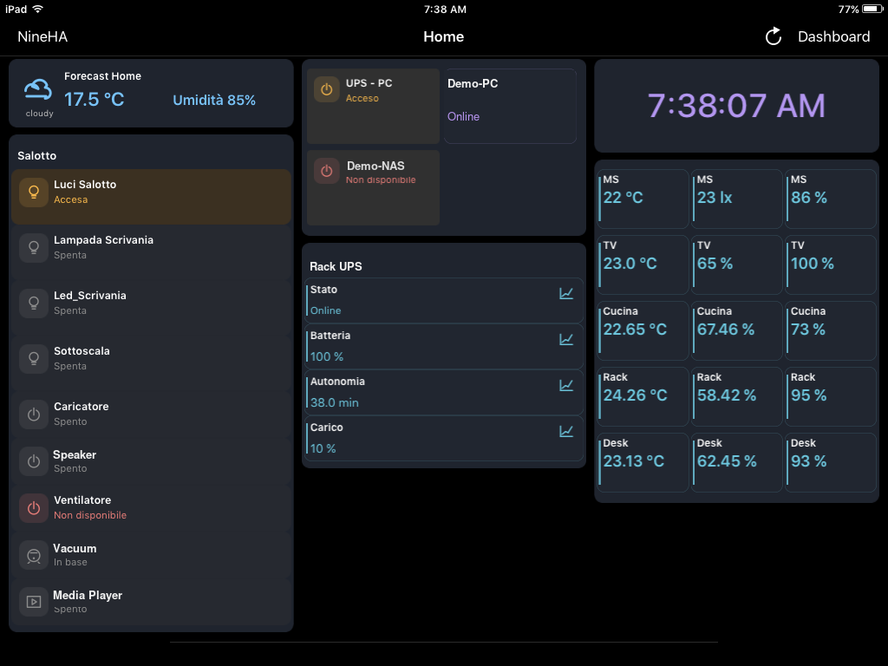
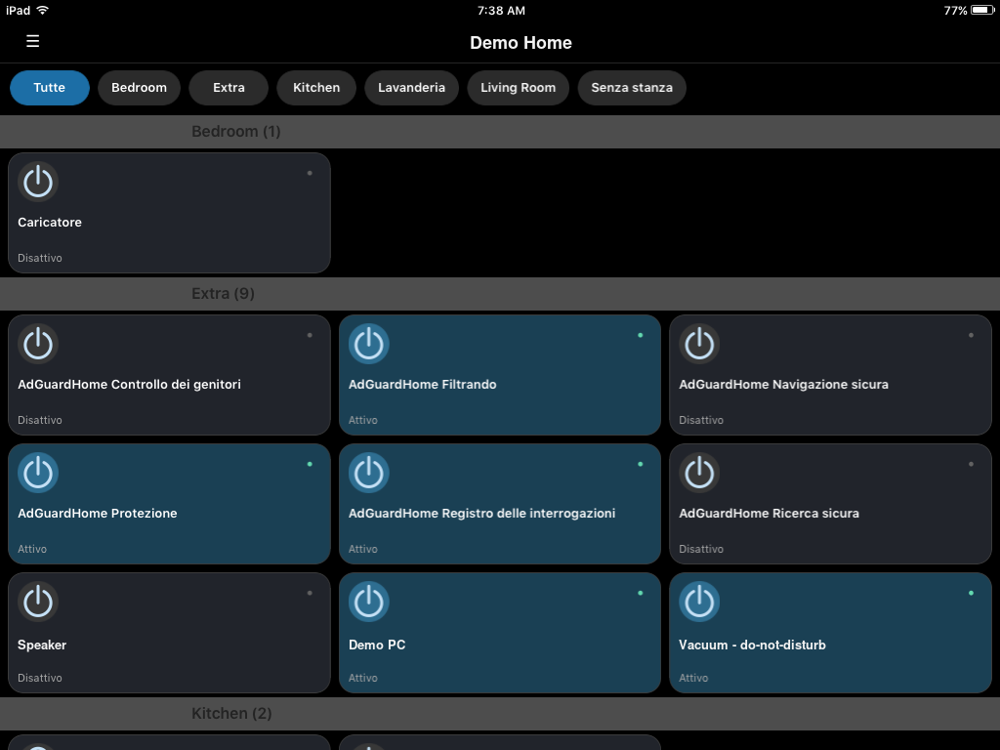
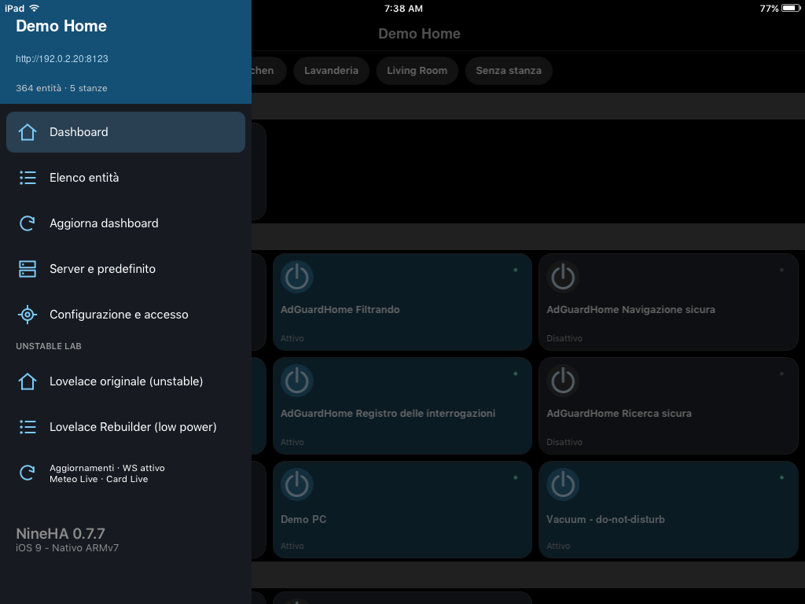
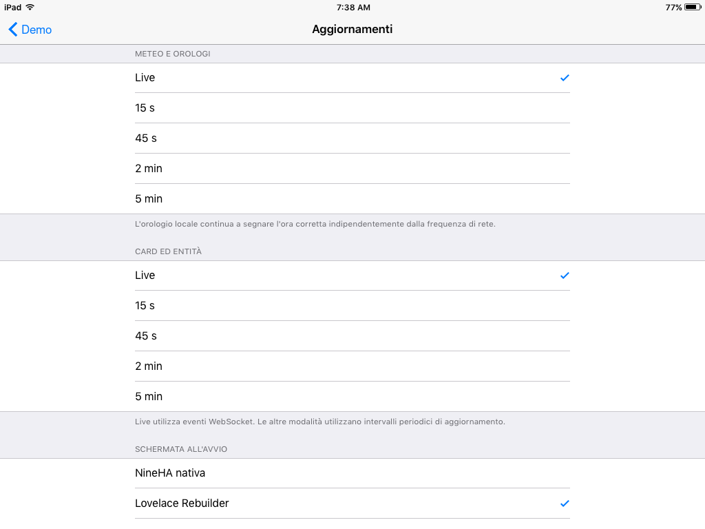
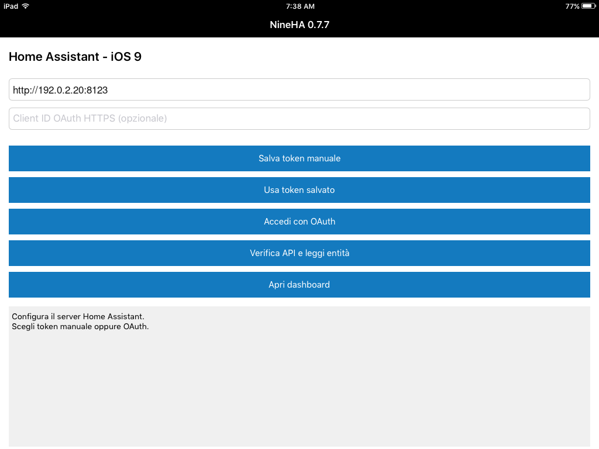

# NineHA

NineHA è un client Home Assistant nativo pensato per dispositivi fermi a iOS 9.
Il progetto viene compilato con Theos e Clang per ARMv7 ed è stato collaudato
su iPad mini di prima generazione e iPhone 4S. Su entrambi i dispositivi il
Rebuilder e le funzioni principali risultano operativi.

> Stato del progetto: sperimentale. NineHA non è un prodotto ufficiale di Home
> Assistant e non è affiliato a Nabu Casa.

## Screenshot

| Dashboard responsiva | Lovelace Rebuilder |
|---|---|
|  |  |
| Dashboard nativa | Impostazioni aggiornamento |
|  |  |
| Configurazione iniziale | |
|  | |

Le schermate utilizzano indirizzi riservati alla documentazione e nomi dimostrativi; non contengono configurazioni Home Assistant private.

## Funzioni principali

- autenticazione con token manuale e flusso OAuth sperimentale;
- dashboard nativa, Lovelace Rebuilder UIKit e Lovelace originale in WebView;
- aggiornamenti live tramite WebSocket, con fallback REST;
- layout Lovelace `masonry`, `grid`, `sections` e `conditional`;
- adattatori nativi per card standard e per varie card custom, tra cui Mushroom,
  Button Card, Bubble Card ed Entity Progress Card;
- supporto nativo di base per `media-control`;
- azioni `tap_action`, `hold_action`, toggle, `call-service`,
  `perform-action`, chiamate REST e Wake-on-LAN;
- pannello nativo per la luminosità delle luci e pannello dettagli entità;
- interfaccia scura responsiva ottimizzata per schermi iPad e iPhone legacy;
- rotazione automatica portrait/landscape, con tutti gli orientamenti su iPad.

Le card non riconosciute vengono mostrate come non supportate anziché essere
eseguite come codice web nel Rebuilder.

## Requisiti

- Linux;
- Theos con toolchain Clang;
- SDK iOS 9.2;
- `ideviceinstaller`/libimobiledevice per l'installazione;
- dispositivo iOS compatibile configurato per eseguire l'app.

## Compilazione

```bash
export THEOS="$HOME/theos"
make clean package FINALPACKAGE=1
```

Il pacchetto IPA viene creato nella directory `packages/`.

## Download

La build finale precompilata per ARMv7 è disponibile qui:

- [NineHA 0.7.8 build 47](Releases/NineHA-0.7.8-armv7.ipa)
- [checksum SHA-256](Releases/SHA256SUMS.txt)

## Installazione

Con il dispositivo collegato:

```bash
ideviceinstaller install NineHA-0.7.8-armv7.ipa
```

Per aggiornare un'installazione già presente si può usare invece
`ideviceinstaller upgrade`. Il nome dell'IPA generata localmente può variare in
base alla versione di Theos.

## Azioni Lovelace

La build 47 interpreta sia la sintassi legacy `call-service` sia la sintassi
`perform-action`. I campi `data`, `service_data` e il singolo
`target.entity_id` vengono inoltrati al servizio Home Assistant dopo una
conferma esplicita nell'interfaccia.

Esempi, limiti e indicazioni per aggiungere nuovi servizi sono disponibili in
[Azioni Lovelace e nuovi servizi](docs/lovelace-actions.md).

## Configurazione locale opzionale

La build pubblica non contiene entity ID, servizi o nomi appartenenti a una
specifica installazione Home Assistant. Per abilitare l'adattatore NAS e una
lista esplicita di switch con toggle predefinito:

```bash
cp Sources/NineLocalConfig.user.h.example Sources/NineLocalConfig.user.h
```

Modificare quindi soltanto `Sources/NineLocalConfig.user.h`. Il file è escluso
da Git. Non inserirvi token, password o altre credenziali.

Questa configurazione è necessaria soltanto per gli adattatori nativi locali e
per i toggle predefiniti esplicitamente autorizzati. Le normali azioni
`call-service` e `perform-action` non richiedono modifiche al file locale.

## Privacy e sicurezza

NineHA non include URL di server, token o configurazioni personali. I token
salvati dall'app vengono conservati nel portachiavi di iOS.

Per consentire l'uso con installazioni Home Assistant locali legacy, la build
permette anche connessioni HTTP. Quando possibile usare HTTPS oppure una VPN e
non esporre direttamente Home Assistant su Internet. iOS 9 e i dispositivi
jailbroken non ricevono le protezioni di sicurezza dei sistemi moderni.

Per segnalazioni riservate consultare [SECURITY.md](SECURITY.md).

## Dipendenze

Il repository include SocketRocket nella directory `ThirdParty/SocketRocket`.
La relativa licenza è conservata accanto ai sorgenti della libreria.

## Licenza

Il codice NineHA è distribuito con licenza MIT. Le dipendenze incluse restano
soggette alle rispettive licenze; in particolare, la licenza di SocketRocket è
conservata nella sua directory.
